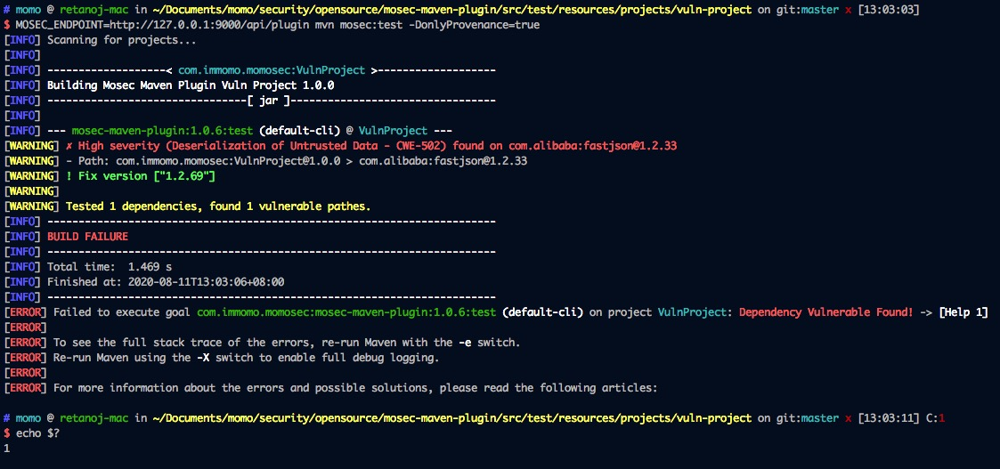
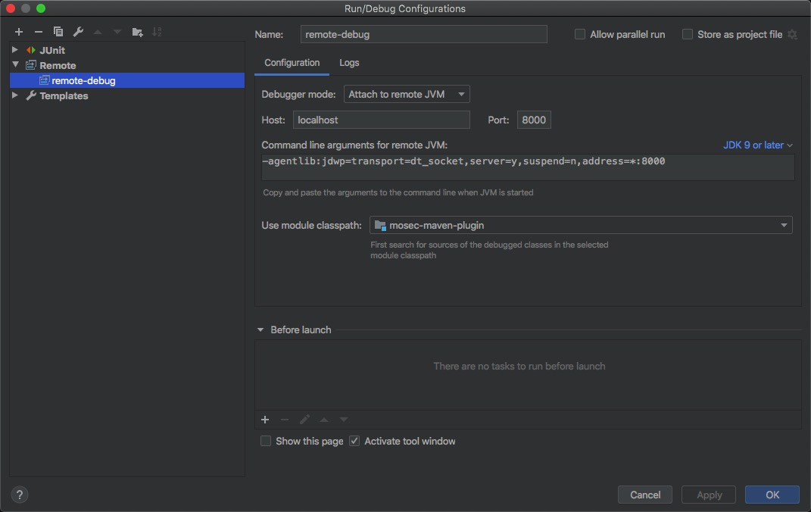

# MOSEC-MAVEN-PLUGIN

用于检测maven项目的第三方依赖组件是否存在安全漏洞。

该项目是基于 [snyk-maven-plugin](https://github.com/snyk/snyk-maven-plugin.git) 的二次开发。


## 关于我们

Website：https://security.immomo.com

WeChat:

<br>


## 版本要求

Maven >= 3.1


## 安装

#### 向pom.xml中添加plugin仓库 (项目级安装)

```xml
<!-- pom.xml -->

<pluginRepositories>
  <pluginRepository>
      <id>gh</id>
      <url>https://raw.githubusercontent.com/momosecurity/mosec-maven-plugin/master/mvn-repo/</url>
  </pluginRepository>
</pluginRepositories>
```

#### 向maven配置中添加plugin仓库 (全局安装)

```xml
<!-- settings.xml -->

<!-- 添加pluginGroup可简化命令行参数 -->
<pluginGroups>
    <pluginGroup>com.immomo.momosec</pluginGroup>
</pluginGroups>

<profiles>
    <profile>
      <id>momo-plugin</id>
      <pluginRepositories>
        <pluginRepository>
            <id>gh</id>
            <url>https://raw.githubusercontent.com/momosecurity/mosec-maven-plugin/master/mvn-repo/</url>
        </pluginRepository>
      </pluginRepositories>
    </profile>
</profiles>

<activeProfiles>
    <activeProfile>momo-plugin</activeProfile>
</activeProfiles>
```


## 使用

首先运行 [MOSEC-X-PLUGIN Backend](https://github.com/momosecurity/mosec-x-plugin-backend.git)

#### 命令行使用
```
> cd your_maven_project_dir/

> MOSEC_ENDPOINT=http://127.0.0.1:9000/api/plugin \
  mvn com.immomo.momosec:mosec-maven-plugin:1.0.7:test \
  -DonlyProvenance=true

// 或简化方式

> MOSEC_ENDPOINT=http://127.0.0.1:9000/api/plugin \
  mvn mosec:test -DonlyProvenance=true
```

#### 项目中使用

```xml
<!-- pom.xml -->

<plugins>
    <plugin>
        <groupId>com.immomo.momosec</groupId>
        <artifactId>mosec-maven-plugin</artifactId>
        <version>1.0.7</version>
        <executions>
            <execution>
                <id>test</id>
                <goals>
                    <goal>test</goal>  <!-- test过程执行 -->
                </goals>
            </execution>
        </executions>
        <configuration>
            <endpoint>http://127.0.0.1:9000/api/plugin</endpoint>
            <severityLevel>High</severityLevel>
            <onlyProvenance>true</onlyProvenance>
            <failOnVuln>true</failOnVuln>
        </configuration>
    </plugin>
</plugins>
```


## 帮助

```shell script
> mvn mosec:help -Ddetail=true

mosec:test

  Available parameters:

    endpoint
      上报API
      User property: endpoint

    failOnVuln (Default: true)
      发现漏洞即编译失败
      User property: failOnVuln

    includeProvidedDependency (Default: false)
      是否包含Provided Scope依赖
      User property: includeProvidedDependency

    onlyAnalyze (Default: false)
      仅分析依赖，不上报
      User property: onlyAnalyze

    onlyProvenance (Default: false)
      仅检查直接依赖
      User property: onlyProvenance

    outputDepToFile (Default: )
      输出依赖树到文件，如果用户设置了onlyAnalyze=true则仅输出依赖树，否则输出依赖树以及漏洞检查结果
      User property: outputDepToFile

    severityLevel (Default: High)
      威胁等级 [High|Medium|Low]
      User property: severity
```


## 使用效果

以 src/test/resources/projects/vuln-project 项目为例。

[WARNING] 部分给出漏洞警告，Path: 为漏洞依赖链，Fix version 为组件安全版本。

程序返回值为1，表示发现漏洞。返回值为0，即为未发现问题。




## 检测原理

MOSEC-MAVEN-PLUGIN使用`org.apache.maven:maven-core`组件中提供的`aether-api`提取依赖并构建依赖树。

该方法可以准确提取maven项目所使用的依赖，以及确定的依赖版本。

最终依赖树会交由 [MOSEC-X-PLUGIN-BACKEND](https://github.com/momosecurity/mosec-x-plugin-backend.git) 检测服务进行检测，并返回结果。

相关数据结构请参考 MOSEC-X-PLUGIN-BACKEND [README.md](https://github.com/momosecurity/mosec-x-plugin-backend/blob/master/README.md).


## 开发

#### Intellij 远程调试 Maven 插件

1.将mosec-maven-plugin拉取至本地仓库

2.git clone mosec-maven-plugin 源码

3.Intellij 打开mosec-maven-plugin项目，新建 Remote Configuration 并填入如下信息



4.在另一个maven工程中执行如下命令

```shell script
> mvnDebug com.immomo.momosec:mosec-maven-plugin:1.0.7:test
```

5.回到Intellij中，下断点，开始Debug